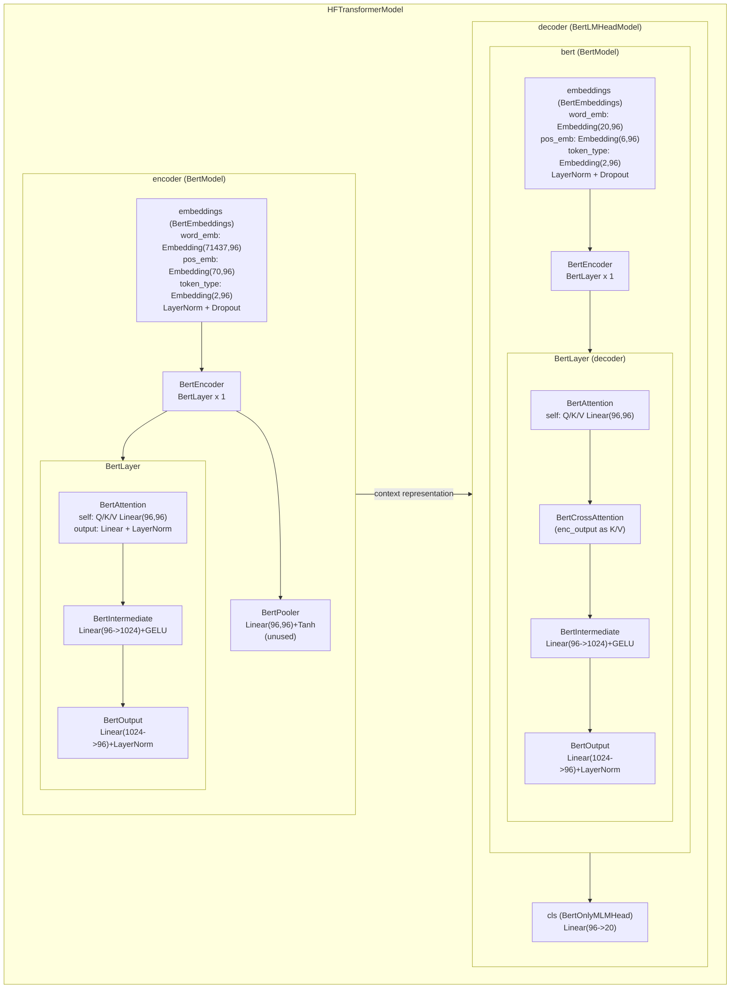

# RecForest

RecForest is a research-style recommendation repository built around the Gowalla dataset.

The repository contains two main pipelines:

- `notebooks/gowalla/gowalla_DIN.ipynb`: a `DINTrain` baseline
- `notebooks/gowalla/gowalla.ipynb`: a multi-tree `Trm4Rec` pipeline with reranking

The codebase is notebook-driven. There is no checked-in `pytest`, `make`, or CI workflow.

## What The Project Does

This project studies large-scale sequential recommendation.

Given a user's historical item sequence, the models try to recommend future items.

The repository currently focuses on:

- sequence-based recommendation on Gowalla-style data
- a DIN baseline that scores `(user history, candidate item)` pairs
- a tree-based Transformer retrieval model (`Trm4Rec`) that predicts item paths instead of directly scoring all items

## Repository Structure

- `lib/`
  - core model and preprocessing code
- `notebooks/gowalla/`
  - primary entry notebooks
- `data/gowalla/`
  - preprocessed training / validation / test artifacts, saved models, and tree files
- `scripts/`
  - small analysis helpers

Important files:

- `lib/DIN_Model.py`: Deep Interest Network implementation
- `lib/DIN_trainer.py`: training and inference helpers for DIN
- `lib/Trm4Rec_trainer.py`: tree-based Transformer training and inference
- `lib/Tree_Model.py`: tree encoding / decoding logic
- `lib/generate_train_and_test_data.py`: raw-to-sample preprocessing
- `lib/generate_training_batches.py`: sample file loading and batching

## Data Layout

The repository is wired for preprocessed data by default.

Included under `data/gowalla/`:

- `train_instances_0..9`
- `test_instances`
- `validation_instances`
- `user_item_num.txt`
- `DIN_MODEL.pt`
- `model/`
- `tree/`

Not included:

- raw `data/gowalla/gowalla.txt`

`user_item_num.txt` stores two numbers:

- first line: number of users
- second line: number of items

## Tree Files

The tree-based `Trm4Rec` pipeline relies on two complementary mapping files per tree:

- `*_item_to_code_tree_id_*.npy`
- `*_code_to_item_tree_id_*.npy`

Their roles are:

- `item_to_code`
  - maps an `item_id` to its tree path
  - shape is typically `(item_num, tree_height)`
  - each row is a path such as `[branch_1, branch_2, ..., branch_h]`
  - used during training, when an item label is converted into a path target for the decoder

- `code_to_item`
  - maps a leaf-code position back to an `item_id`
  - shape is typically `(num_leaves,)`
  - used during inference, when a predicted path is decoded back into an item

In short:

```text
item_id -> item_to_code -> path tokens
predicted path -> code_to_item -> item_id
```

Both directions are required for the full tree retrieval workflow.

## Model Checkpoints

Under `data/gowalla/model/`, the checked-in files follow the multi-tree `Trm4Rec` design:

- `*_model_encoder_k*.pt`
  - the shared encoder checkpoint
  - reused across all trees in the forest
  - encodes user history sequences

- `*_model_decoder_tree_id_*.pt`
  - the decoder checkpoint for one specific tree
  - each tree has its own decoder because each tree predicts its own path distribution

For example:

- `embkm1.0_model_encoder_k18.pt`
  - shared encoder for `init_way=embkm`, `feature_ratio=1.0`, `k=18`

- `embkm1.0_model_decoder_tree_id_0_k18.pt`
  - decoder for tree `0` under the same setup

This matches the notebook design:

- one shared encoder
- one decoder per tree

## Encoder And Decoder In Trm4Rec

In this project, both the `encoder` and `decoder` belong to the Encoder-Decoder Transformer used by `Trm4Rec`.

Code entrypoints:

- `lib/HF_Model.py`
- `lib/Trm4Rec_trainer.py`

### Encoder

The encoder consumes the user history sequence:

```text
history item ids = [item1, item2, ..., item69]
```

In this repository:

- the source vocabulary size is `item_num + 1`
- history tokens are item ids
- the extra token is the padding id

Its job is to turn user history into a contextual hidden representation.

### Decoder

The decoder does not directly predict item ids.
It predicts tree-path tokens conditioned on:

- the encoder output
- the already generated path prefix

For example, if one item is mapped to:

```text
[6, 14, 12, 12]
```

then the decoder learns a path-generation process like:

```text
[start] -> 6
[start, 6] -> 14
[start, 6, 14] -> 12
[start, 6, 14, 12] -> 12
```

So the decoder is effectively a path generator / path classifier.

### Why The Model Is Split This Way

`Trm4Rec` does not solve:

```text
history -> item score
```

Instead, it solves:

```text
history -> path sequence -> item
```

That is why an encoder-decoder structure is a natural fit:

- the encoder processes user history
- the decoder generates the item path

### Why Multiple Trees Share One Encoder

In `gowalla.ipynb`:

- each tree has its own decoder
- all trees share the same encoder

This design assumes that:

- user history representation should be shared across trees
- different trees mainly differ in how items are encoded and decoded

So the project uses:

```text
shared encoder + one decoder per tree
```

This is also why the repository stores:

- one shared `*_model_encoder_k*.pt`
- multiple `*_model_decoder_tree_id_*.pt`

### Relation To DIN

`DIN` is a scoring model:

```text
history + candidate item -> score
```

`Trm4Rec` is a generative retrieval model:

```text
encoder(history) + decoder(path prefix) -> next path token
```

### Model Structure Diagram



## Sample Formats

Training samples (`train_instances_*`) use:

```text
user|history_1,...,history_69|label
```

Evaluation samples (`test_instances`, `validation_instances`) use:

```text
user|history_1,...,history_69|future_label_1,...,future_label_k
```

So the repository trains with a single next-item label, but evaluates against a future-item set.

## How To Run

The notebooks assume the working directory is `notebooks/gowalla`.

Example:

```bash
jupyter notebook
```

Then open:

- `notebooks/gowalla/gowalla_DIN.ipynb`
- `notebooks/gowalla/gowalla.ipynb`

## Dependencies

The repository does not define a formal environment file for the original project setup.

In practice, the code imports at least:

- `torch`
- `transformers`
- `numpy`
- `joblib`
- `tqdm`
- `pandas`
- `matplotlib`
- Jupyter / IPython

## Important Notes

- `have_processed_data=True` is the default path in the notebooks.
- `Train_instance.training_batches()`, `test_batches()`, `validation_batches()`, and `generate_training_records()` are infinite generators.
- `DINTrain.update_DIN()` handles `backward()`, `step()`, and `zero_grad()` internally.
- `Trm4Rec.update_model()` only returns a loss. The notebook owns the optimizer step.
- `gowalla.ipynb` expects generated tree files. The checked-in tree folder does not include every file needed to reproduce the original multi-tree setup from scratch.
- `lib/__init__.py` safely tolerates a missing `JTM_variant.py`, which is not present in this checkout.

## Current Caveat About Raw Gowalla

The preprocessing code assumes a custom 5-column raw schema:

```text
user_id,item_id,cat_id,behavior,timestamp
```

This does not match the commonly distributed raw Gowalla check-in format.

That means the repository most likely used a transformed intermediate Gowalla file rather than the standard public raw file directly.

## Reading Order Recommendation

If you want to understand the project, this is the most effective order:

1. `notebooks/gowalla/gowalla_DIN.ipynb`
2. `lib/generate_training_batches.py`
3. `lib/DIN_trainer.py`
4. `lib/DIN_Model.py`
5. `lib/generate_train_and_test_data.py`
6. `notebooks/gowalla/gowalla.ipynb`
7. `lib/Trm4Rec_trainer.py`
8. `lib/Tree_Model.py`
