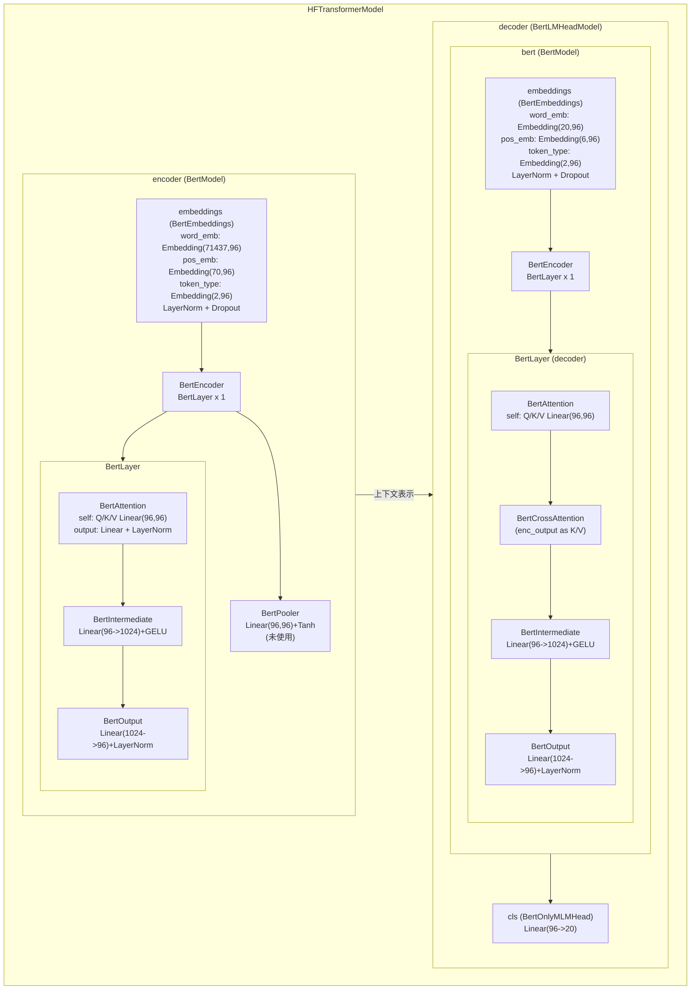

# RecForest

RecForest 是一个围绕 Gowalla 数据集构建的研究型推荐系统仓库。

仓库包含两条主要实验链路：

- `notebooks/gowalla/gowalla_DIN.ipynb`：`DINTrain` 基线
- `notebooks/gowalla/gowalla.ipynb`：多树 `Trm4Rec` + rerank 主方法

这个仓库主要由 notebook 驱动，没有标准的 `pytest`、`make` 或 CI 流程。

## 项目做什么

这个项目研究大规模序列推荐问题。

给定用户的历史 item 序列，模型尝试推荐未来的 item。

仓库当前重点包括：

- Gowalla 风格数据上的序列推荐
- 用 `DIN` 作为 `(用户历史, 候选 item)` 打分基线
- 用树结构 Transformer 检索模型 `Trm4Rec` 预测 item path，而不是直接对所有 item 打分

## 仓库结构

- `lib/`
  - 核心模型和预处理代码
- `notebooks/gowalla/`
  - 主入口 notebook
- `data/gowalla/`
  - 预处理后的训练 / 验证 / 测试数据、已保存模型、树文件
- `scripts/`
  - 小型分析脚本

重要文件：

- `lib/DIN_Model.py`：Deep Interest Network 实现
- `lib/DIN_trainer.py`：DIN 的训练与推理辅助代码
- `lib/Trm4Rec_trainer.py`：树结构 Transformer 的训练与推理
- `lib/Tree_Model.py`：树编码 / 解码逻辑
- `lib/generate_train_and_test_data.py`：原始数据到样本文件的预处理
- `lib/generate_training_batches.py`：样本文件读取与 batch 构造

## 数据布局

仓库默认使用已经预处理好的数据。

`data/gowalla/` 中已包含：

- `train_instances_0..9`
- `test_instances`
- `validation_instances`
- `user_item_num.txt`
- `DIN_MODEL.pt`
- `model/`
- `tree/`

未包含：

- 原始 `data/gowalla/gowalla.txt`

`user_item_num.txt` 保存两个数字：

- 第 1 行：用户数
- 第 2 行：item 数

## 树文件说明

树检索模型 `Trm4Rec` 每棵树都依赖两类互补的映射文件：

- `*_item_to_code_tree_id_*.npy`
- `*_code_to_item_tree_id_*.npy`

它们的作用分别是：

- `item_to_code`
  - 把 `item_id` 映射成树路径
  - 形状通常是 `(item_num, tree_height)`
  - 每一行是一条路径，例如 `[branch_1, branch_2, ..., branch_h]`
  - 训练时使用：把 item 标签转换成 decoder 要预测的 path token 序列

- `code_to_item`
  - 把叶子节点编码位置反向映射回 `item_id`
  - 形状通常是 `(num_leaves,)`
  - 推理时使用：把模型预测出来的 path 解码回具体 item

简单说就是：

```text
item_id -> item_to_code -> path tokens
predicted path -> code_to_item -> item_id
```

要跑完整的树检索流程，这两个方向的映射都需要。

## 模型检查点说明

`data/gowalla/model/` 目录中的文件对应多树 `Trm4Rec` 设计：

- `*_model_encoder_k*.pt`
  - 共享的 encoder checkpoint
  - 多棵树共用同一个 encoder
  - 用于编码用户历史序列

- `*_model_decoder_tree_id_*.pt`
  - 某一棵树专属的 decoder checkpoint
  - 每棵树都有自己的 decoder，因为每棵树要预测自己的 path 分布

例如：

- `embkm1.0_model_encoder_k18.pt`
  - 表示 `init_way=embkm`、`feature_ratio=1.0`、`k=18` 条件下的共享 encoder

- `embkm1.0_model_decoder_tree_id_0_k18.pt`
  - 表示同样配置下第 `0` 棵树的 decoder

这和 notebook 中的设计一致：

- 一个共享 encoder
- 每棵树一个独立 decoder

## Trm4Rec 里的 Encoder 和 Decoder

在这个项目里，`encoder` 和 `decoder` 都属于 `Trm4Rec` 使用的 Encoder-Decoder Transformer。

代码入口：

- `lib/HF_Model.py`
- `lib/Trm4Rec_trainer.py`

### Encoder 是什么

encoder 处理用户历史序列：

```text
history item ids = [item1, item2, ..., item69]
```

在这个仓库里：

- source vocab 大小是 `item_num + 1`
- 历史里的 token 就是 item id
- 多出来的一个 token 是 padding id

它的作用是把用户历史压成上下文隐藏表示。

### Decoder 是什么

decoder 不直接预测 item id。
它会在以下条件下预测树路径 token：

- encoder 输出的用户历史表示
- 当前已经生成的 path 前缀

例如，如果某个 item 被编码成：

```text
[6, 14, 12, 12]
```

那么 decoder 学的是这样的路径生成过程：

```text
[start] -> 6
[start, 6] -> 14
[start, 6, 14] -> 12
[start, 6, 14, 12] -> 12
```

所以 decoder 本质上是一个路径生成器 / 路径分类器。

### 为什么要拆成 Encoder / Decoder

`Trm4Rec` 不是直接做：

```text
history -> item score
```

它做的是：

```text
history -> path sequence -> item
```

因此 encoder-decoder 结构非常自然：

- encoder 处理用户历史
- decoder 生成 item path

### 为什么多棵树共享一个 Encoder

在 `gowalla.ipynb` 里：

- 每棵树都有自己的 decoder
- 所有树共享同一个 encoder

这个设计背后的假设是：

- 用户历史表示应该在不同树之间共享
- 不同树的主要差别在于 item 的编码 / 解码方式不同

因此项目采用：

```text
共享 encoder + 每棵树一个 decoder
```

这也解释了为什么仓库里保存的是：

- 一个共享 `*_model_encoder_k*.pt`
- 多个 `*_model_decoder_tree_id_*.pt`

### 和 DIN 的区别

`DIN` 是打分式模型：

```text
history + candidate item -> score
```

`Trm4Rec` 是生成式检索模型：

```text
encoder(history) + decoder(path prefix) -> next path token
```

### 模型结构图



## 样本格式

训练样本（`train_instances_*`）格式：

```text
user|history_1,...,history_69|label
```

评估样本（`test_instances`、`validation_instances`）格式：

```text
user|history_1,...,history_69|future_label_1,...,future_label_k
```

也就是说：

- 训练时使用单个 next-item 标签
- 评估时使用未来 item 集合作为目标

## 如何运行

notebook 假设当前工作目录是 `notebooks/gowalla`。

例如：

```bash
jupyter notebook
```

然后打开：

- `notebooks/gowalla/gowalla_DIN.ipynb`
- `notebooks/gowalla/gowalla.ipynb`

## 依赖

仓库没有完整保存原始项目环境文件。

从代码看，至少依赖：

- `torch`
- `transformers`
- `numpy`
- `joblib`
- `tqdm`
- `pandas`
- `matplotlib`
- Jupyter / IPython

## 重要说明

- notebook 默认走 `have_processed_data=True` 路径。
- `Train_instance.training_batches()`、`test_batches()`、`validation_batches()`、`generate_training_records()` 都是无限生成器。
- `DINTrain.update_DIN()` 内部会自己执行 `backward()`、`step()`、`zero_grad()`。
- `Trm4Rec.update_model()` 只返回 loss，优化器更新由 notebook 外层负责。
- `gowalla.ipynb` 依赖已生成好的树文件。当前仓库中的 `tree/` 不包含完全复现实验所需的全部文件。
- `lib/__init__.py` 可以容忍缺失的 `JTM_variant.py`，当前仓库中这个文件并不存在。

## 关于原始 Gowalla 的现状

预处理代码假设原始文件是一个自定义 5 列格式：

```text
user_id,item_id,cat_id,behavior,timestamp
```

这和常见公开 Gowalla raw check-in 格式并不一致。

这意味着：

仓库大概率不是直接使用标准公开 Gowalla raw，而是先使用了一个中间转换版本。

## 推荐阅读顺序

如果你想快速理解这个项目，推荐顺序：

1. `notebooks/gowalla/gowalla_DIN.ipynb`
2. `lib/generate_training_batches.py`
3. `lib/DIN_trainer.py`
4. `lib/DIN_Model.py`
5. `lib/generate_train_and_test_data.py`
6. `notebooks/gowalla/gowalla.ipynb`
7. `lib/Trm4Rec_trainer.py`
8. `lib/Tree_Model.py`
